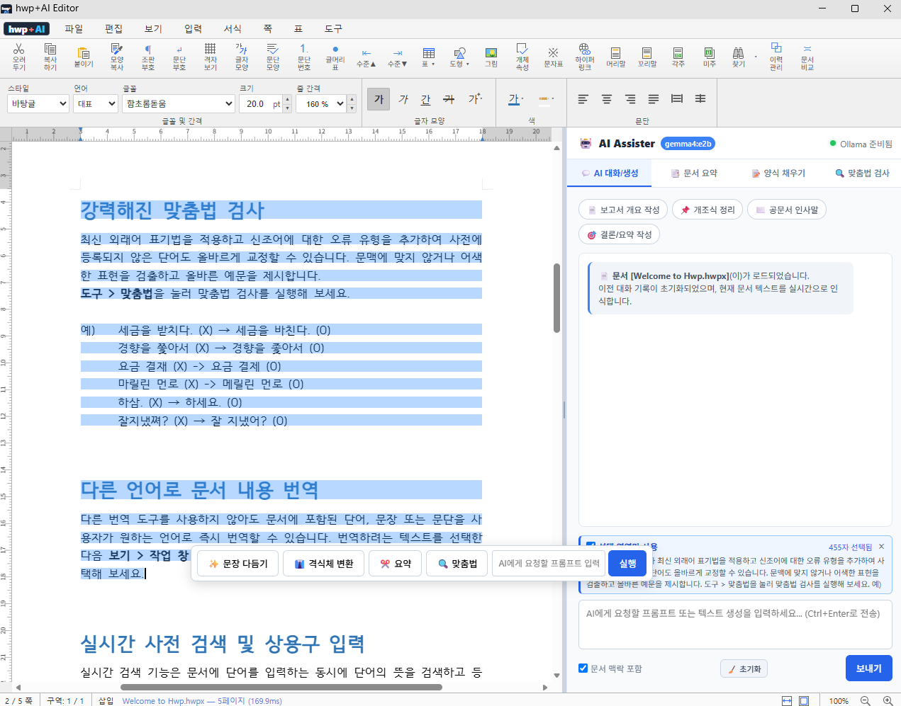

# 📄 hwp+AI Editor — Local HWPX AI Editor Studio

> **100% 로컬 / 오프라인(Air-Gapped) 기반 AI 조수 결합 HWPX 에디터 & 데스크톱 스탠드얼론 앱**  
> 외부 네트워크 통신 0 Byte, 데이터 유출 걱정 없는 보안 한글(HWPX) 문서 편집 & 로컬 LLM (`gemma4:e2b`) 통합 에디터

---

## 🛡️ 프로젝트 정체성 (Core Identity)

1. **클라우드 API 통신 0%**: OpenAI, Anthropic, Google Cloud 등 외부 AI API를 일절 사용하지 않고, 사용자의 PC 내부 루프백(`http://localhost:11434`)의 Ollama 로컬 LLM(`gemma4:e2b`)만 사용합니다.
2. **문서 유출 제로 (Zero Data Leakage)**: 문서 파싱, 편집, 렌더링, PDF 변환 등의 모든 고성능 작업이 메모리 내 **Rust WebAssembly Engine**에서 처리되어 외부로 데이터가 전송될 위험이 전혀 없습니다.
3. **완벽한 망분리/오프라인 지원**: 인터넷 연결을 차단(Wi-Fi off / 랜선 제거)하더라도 모든 편집 및 AI 기능이 100% 정상 작동합니다.
4. **데스크톱 스탠드얼론(Stand-Alone) 지원**: 웹 브라우저 PWA 모드 및 **Tauri v2 네이티브 데스크톱 실행 파일(.exe)**을 완벽 지원합니다.

---

## ✅ 시작하기 전에 (요구사항)

| 항목 | 필요 여부 | 비고 |
|---|---|---|
| **Node.js 20 이상** (권장 22+) | 필수 | [nodejs.org](https://nodejs.org)에서 설치 |
| **Ollama** | 선택 | AI 조수 기능을 쓸 때만 필요. 없어도 문서 편집 기능은 정상 작동 |
| **Rust + Cargo** | 선택 | 데스크톱 실행 파일(.exe/.msi)을 직접 빌드할 때만 필요 |

---

## 🚀 빠른 시작 (Quick Start)

```bash
# 1. 저장소 받기
git clone https://gitlab.aigov.go.kr/Ubermensch/hwpai.git
cd hwpai

# 2. 의존성 설치
npm install

# 3. 개발 서버 실행
npm run dev
```

실행 후 브라우저에서 **http://localhost:7700** 으로 접속하면 바로 에디터를 사용할 수 있습니다.

---

## 🖥️ 상황별 실행 방법

### 1) 개발 모드 — 코드를 수정하며 바로 확인
```bash
npm run dev
```
파일을 저장하면 브라우저가 즉시 갱신됩니다(HMR). 평소 개발 작업에 사용하세요.

### 2) 정적 빌드 + 로컬 서버 — 실사용/배포용
```bash
npm run build       # dist/ 폴더에 정적 파일 생성
npm run standalone   # node server.mjs — 로컬 웹서버 실행
```
브라우저에서 **http://127.0.0.1:7700** 으로 접속합니다. 7700번 포트에 이미 이 앱의 서버가 떠 있으면 새로 띄우지 않고 그대로 재사용하며(설치된 PWA가 기억하는 주소가 어긋나지 않도록), 다른 프로그램이 점유 중이면 7701, 7702… 순으로 빈 포트를 찾습니다. 실제로 열린 포트 번호는 `server-port.txt` 파일에 기록됩니다.

> **참고**: dev 서버와 standalone 서버는 같은 주소(`127.0.0.1:7700`)를 씁니다. 브라우저는 이를 동일 origin으로 보기 때문에 dev 전용 서비스 워커가 등록되면 standalone 실행 화면까지 오염됩니다. 그래서 `VitePWA`의 `devOptions`는 꺼 두었고(dev에서는 서비스 워커를 등록하지 않음), 과거에 등록된 워커는 `public/dev-sw.js`와 `public/theme-init.js`가 접속 시 자동으로 정리합니다.

### 3) 더블클릭 한 번으로 실행 — 가장 쉬운 방법 (일반 사용자 추천)
탐색기에서 아래 파일을 더블클릭하기만 하면 됩니다.

- **`hwpai.bat`** — 실행 상태를 보여주는 콘솔 창이 함께 뜸
- **`hwpai.vbs`** — 콘솔 창 없이 조용히 실행됨

동작 순서는 자동으로 처리됩니다: `dist/index.html`이 없으면 빌드 → 로컬 서버 실행 → 설치된 Edge 또는 Chrome을 "앱 모드"로 자동으로 띄워줍니다(둘 다 없으면 기본 브라우저로 열림).

### 4) 데스크톱 네이티브 앱 (Tauri, .exe/.msi)
Rust/Cargo가 설치되어 있어야 합니다.

```bash
# 개발 중 데스크톱 창으로 바로 실행
npm run dev:tauri

# 배포용 설치 파일(.exe / .msi) 빌드
npm run build:tauri
```
빌드가 끝나면 `src-tauri/target/release/bundle/` 아래에 설치 파일이 생성됩니다. 실행 파일 이름은 `hwpai.exe`, 제품명은 `hwp+AI Editor`입니다.

---

## 🤖 로컬 AI(Ollama) 조수 사용법

AI 조수 기능을 쓰려면 아래 절차로 Ollama를 준비하세요. (설치하지 않아도 문서 편집·저장 등 기본 기능은 그대로 사용 가능합니다.)

1. [ollama.com](https://ollama.com)에서 Ollama를 설치합니다.
2. 터미널에서 모델을 내려받습니다.
   ```bash
   ollama pull gemma4:e2b
   ```
3. Ollama가 실행되면 `http://localhost:11434`(PC 내부 루프백)로 자동 대기 상태가 되고, 에디터의 AI 조수 패널이 이를 자동으로 인식해 연결합니다. 외부 네트워크로는 어떤 데이터도 나가지 않습니다.

---

## 🧪 테스트 실행

```bash
npm test   # 유닛 테스트
npm run e2e   # 대표 e2e 시나리오 (그 외 개별 e2e 스크립트는 package.json의 "e2e:*" 목록 참고)
```

> **참고**: 이 저장소는 상위 모노레포의 일부만 체크아웃된 상태라, 폰트/코어 엔진 fixture 파일이 없어 유닛 테스트 중 9개는 항상 실패합니다(정상 상태). 현재 기준선은 **pass 823 / fail 9**이며, 실패 목록이 이와 다르면 그때 원인을 조사하면 됩니다.

---

## 🛠️ 문제 해결 (Troubleshooting)

| 증상 | 해결 방법 |
|---|---|
| **화면이 스타일 없이 깨진 채로 뜸** (메뉴가 세로 목록으로 나열됨) | 예전 버전에서 `npm run dev`가 남긴 dev 서비스 워커가 원인입니다. 현재 버전은 접속 시 자동으로 제거하고 새로고침하므로, 한 번 더 실행하면 정상화됩니다. 그래도 남아 있으면 브라우저에서 `Ctrl+Shift+R`로 강력 새로고침하세요 |
| 포트가 이미 사용 중 | 이미 떠 있는 것이 이 앱의 서버면 그대로 재사용하고, 아니면 다음 포트를 찾습니다. 실제 포트는 `server-port.txt`에서 확인하세요 |
| `hwpai.bat` 실행 시 "dist/index.html 없음" 안내 후 멈춤처럼 보임 | 최초 실행 시 자동으로 `npm run build`가 진행 중인 것이니 잠시 기다려 주세요 |
| Edge/Chrome이 자동으로 안 열림 | 두 브라우저가 모두 없는 경우 기본 브라우저의 새 탭으로 열립니다. 안내된 주소를 직접 열어도 됩니다 |
| AI 조수가 응답하지 않음 | Ollama가 설치·실행 중인지, `ollama pull gemma4:e2b`로 모델을 받았는지 확인하세요 |

---

## 📁 주요 폴더 구조

```
hwpAI/
├─ src/            # 프론트엔드(에디터) 소스
├─ src-tauri/       # Tauri 데스크톱 앱 설정 및 아이콘
├─ public/          # 정적 리소스(아이콘, 파비콘 등)
├─ dist/            # 빌드 결과물 (git 미포함, npm run build로 생성)
├─ e2e/             # e2e 테스트 스크립트
├─ tests/           # 유닛 테스트
├─ server.mjs        # standalone 로컬 서버
├─ hwpai.bat / hwpai.vbs   # 더블클릭 실행 런처
└─ package.json
```

---

## 🚀 실행 명령어 전체 목록

```bash
# 개발 서버 (포트 7700)
npm run dev

# 프로덕션 빌드 (dist/)
npm run build

# 빌드 결과물을 로컬 서버로 실행
npm run standalone

# Tauri 데스크톱 개발 실행
npm run dev:tauri

# Tauri Windows 실행 파일 (hwpai.exe / .msi) 빌드
npm run build:tauri

# 유닛 테스트 / e2e 테스트
npm test
npm run e2e
```
